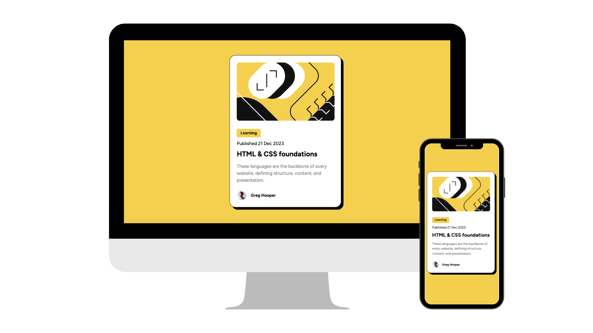

# Blog Preview Card

A responsive blog preview card project built using HTML and SASS. This project showcases a blog preview card with a clean design, suitable for displaying snippets of blog content in an appealing way.

## Features
- **Responsive Design:** Adaptable to both mobile and desktop platforms.
- **Elegant Display:** Showcase of blog content, including an image, title, description, and author information.
- **HTML and SASS:** Utilizes HTML5 for structure and SASS for styling.

## Technologies Used 🛠️
-  HTML: Markup language for structuring the web page.
-  Sass: CSS extension language with additional features.

## Usage Instructions
1. Clone this repository.
2. Navigate to the project directory.
3. Open the `index.html` file in your web browser to view the blog preview card.
4. Explore the responsiveness as you resize your browser window or view it on different devices.

## Customization
Feel free to customize and enhance the blog preview card project according to your preferences:

- Modify the content within the card, such as the image, title, description, and author information.
- Experiment with various color schemes, typography, and visual elements.
- Add any additional features or styles to improve the overall aesthetics.

## States and Interactivity
This project includes styles for various states, such as hover effects on the button. Explore the `styles/_card.scss` file to customize these interactive elements.

## Contributions
Contributions are welcome! If you have ideas for improvements or want to contribute in any way, please submit a pull request.

## Author ✒️
- **Your Name** - [Your GitHub Profile](https://github.com/yourusername)
